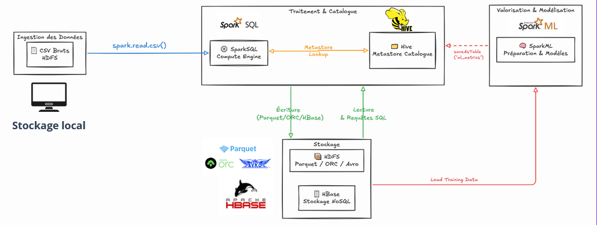

# Projet Big Data — Description détaillée

## Résumé 
Ce dépôt est un projet de comparaison de formats de fichiers (CSV, Avro, ORC, Parquet) et d'architectures de stockage (Parquet/Hive vs HBase), avec des benchmarks d'exécution réalisés via Spark et Hive, ainsi qu'un benchmark de modèles Spark ML. Le projet fournit des scripts pour déployer une infrastructure Docker (HDFS, Hive Metastore, Spark, HBase), générer des données, exécuter des benchmarks et collecter les résultats.

## Objectifs 🎯
- Comparer les performances d'écriture/lecture et la taille des formats de stockage courants.
- Comparer Parquet/Hive et HBase pour les patterns de lecture/écriture ciblés.
- Benchmarker plusieurs modèles Spark ML sur le même jeu de données.
- Fournir scripts reproductibles pour déploiement et mesure.

## Architecture générale 🏗️
- Stockage des données: HDFS (dans le conteneur `namenode`/`datanode`).
- Moteurs: Apache Spark (master/worker) et Hive (metastore).
- Base NoSQL: HBase (master/regionserver) pour comparaison.
- Orchestration locale: `docker-compose.yml` pour lancer l'ensemble.

### Diagramme d'architecture 🖼️




## Arborescence et rôle des principaux fichiers/folders 📁
-- `docker-compose.yml` : définition des services Docker (NameNode, DataNode, Hive Metastore, Spark, HBase, PostgreSQL pour metastore, etc.).
- `config/` : fichiers de configuration pour Hadoop/Hive/HBase.
- `scripts/` : utilitaires pour préparer l'environnement, générer des données et lancer les benchmarks.
  - `generate_data.py` : génération de jeux de données synthétiques.
  - `run_format_benchmark.sh`, `run_full_benchmark.sh`, `run_spark_ml.sh` : scripts d'automatisation.
  - `verify_services.sh` : tests rapides de disponibilité des services.
- `benchmarks/` : scripts PySpark pour effectuer les benchmarks.
  - `benchmark_formats.py` : bench formats (CSV, Avro, ORC, Parquet).
  - `benchmark_hbase.py` : bench lecture/écriture HBase.
  - `benchmark_parquet_complete.py` : bench Parquet complet.
  - `read_csv_hive.py` : importer CSV et créer table Hive.
  - `generate_comparison.py` : consolidation des résultats.
- `spark_ml/` : scripts pour benchmarks Spark ML (`ml_benchmark.py`).
- `data/` : exemples de jeux de données (`sample_sales.csv`, `large_sales.csv`).
- `docs/` : documentation et tutoriels complémentaires (`Tutoriel.md`, `Tutoriel_report.md`).
- `benchmark_results/`, `ml_results_csv/` : sorties/artefacts des benchmarks.

## Dépendances et prérequis
- Docker & Docker Compose (version supportée par les images utilisées)
- Sur la machine hôte: Git et (optionnel) `bash` pour lancer les scripts `.sh` depuis PowerShell.
- Les conteneurs contiennent Spark, Hadoop/HDFS, Hive, HBase, PostgreSQL.

## Quickstart (local, PowerShell sous Windows)
1. Lancer l'infrastructure:

```powershell
docker-compose up -d
```

2. Vérifier les conteneurs:

```powershell
docker-compose ps
```

3. Créer/charger les répertoires HDFS et uploader le CSV de test:

```powershell
docker exec namenode hdfs dfs -mkdir -p /user/data
docker cp .\data\sample_sales.csv namenode:/tmp/sample_sales.csv
docker exec namenode hdfs dfs -put -f /tmp/sample_sales.csv /user/data/sample_sales.csv
```

4. Lancer un benchmark formats (exemple petit jeu de données):

```powershell
docker cp .\benchmarks\benchmark_formats.py spark-master-new:/benchmark_formats.py
docker exec spark-master-new /spark/bin/spark-submit --master spark://spark-master-new:7077 --packages org.apache.spark:spark-avro_2.12:3.1.1 /benchmark_formats.py --input-file "hdfs://namenode:8020/user/data/sample_sales.csv" --dataset-name "small"
```

Pour plus de commandes d'exécution, voir `README.md` existant (guide pas-à-pas détaillé d'exécution).

## Workflow recommandé
- Démarrer les services (`docker-compose up -d`)
- Vérifier l'état (`scripts/verify_services.sh`)
- Générer les données si besoin (`scripts/generate_data.py`)
- Uploader les données dans HDFS
- Lancer les benchmarks (`scripts/run_format_benchmark.sh`, `scripts/run_full_benchmark.sh`)
- Lancer le benchmark ML via `scripts/run_spark_ml.sh`
- Collecter et analyser les résultats dans `benchmark_results/` et `ml_results_csv/`

## Où regarder en cas de problème
- Logs Docker: `docker logs spark-master-new` ou `docker logs hbase-master`.
- Vérifier configuration Hive/HBase dans `config/`.
- Scripts utilitaires: `scripts/diagnose_hbase.sh`, `scripts/show_metrics.py`.

Conclusion 🧾

En synthèse, ce projet fournit une base expérimentale complète et reproductible pour analyser les compromis entre formats de données, architectures de stockage et performances de traitement dans un contexte Big Data.